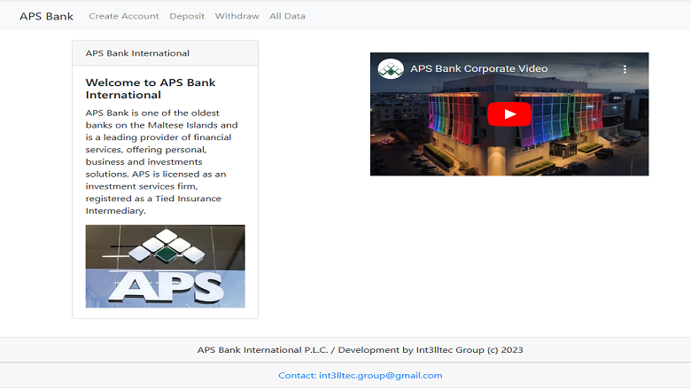

### Title of the project: Banking App...
Description of the project: Banking App in React  
Installation Guidelines:  
How to Run: Select the link in Centurion Tech's Portfolio > Projects  
Technology used: MERN full stack (MongoDB, Express, React, Node.js, Docker
Improvements:   
1. In a future all data will be stored in a Data Base using MongoDB and Docker 
2. The App will be published in AWS 
License: MIT license  

## Banking App Repository
<a href="https://github.com/CenturionTech/centuriontech.github.io/tree/main/BankingApp">Banking App in React </a>
