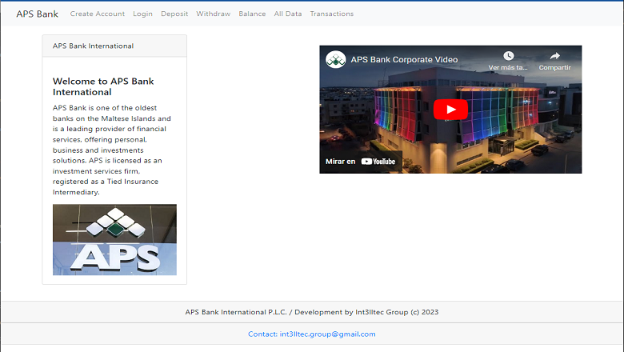

### Title of the project: Banking App...
Description of the project: Banking App in MERN  
Installation Guidelines:  
How to Run: Select the link in Centurion Tech's Portfolio > Projects  
Technology used: MERN full stack (MongoDB, Express, React, Node.js), AWS EC2
Improvements:   
1. The server and app is running in AWS EC2 
2. The DB used is MongoDB 
3. The server is running in Node 
License: MIT license  

## Banking App Repository
<a href="https://github.com/CenturionTech/centuriontech.github.io/tree/main/BankingApp_MERN">Banking App with MERN </a>
