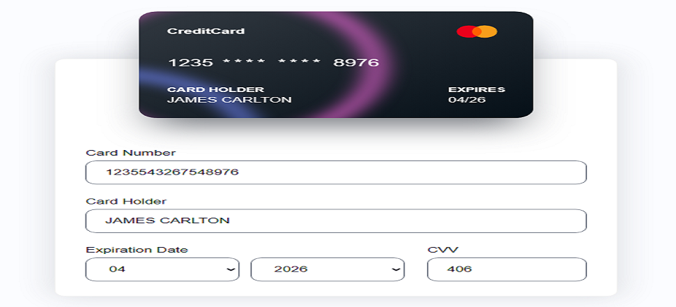

### Title of the project: Credit Card Animation...
Description of the project: Credit Card Animation in HTML/CSS/JS  
Installation Guidelines:  
How to Run: Select the link in Centurion Tech's Portfolio > Projects  
Technology used: HTML, SVG, CSS, JS
Improvements:   

License: MIT license  

## Credit Card Animation Repository
<a href="https://github.com/CenturionTech/centuriontech.github.io/tree/main/CreditCardAnimation">Credit Card Animation </a>
