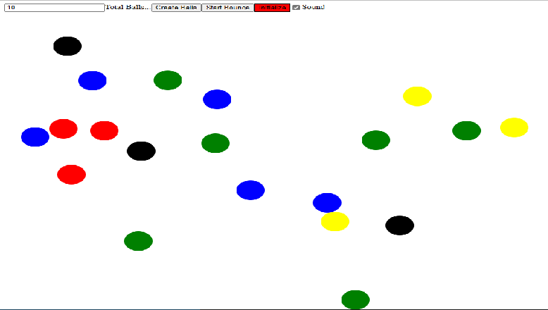

# centuriontech.github.io

## Int3lltec Group WEB Dev Portfolio

### Title of the project: PacMan
Description of the project: Move pacman across the screen  
How to Run: Select the link in Centurion Tech's Portfolio > Projects  
Roadmap of future improvements:  

## PacMan Repository
<a href="https://github.com/CenturionTech/pacman">PacMan Exercise </a>

### Title of the project: PacMen
Description of the project: In this exercise we create and move pacman figures across the screen, each time that pacman reach the borders on the screen (left or right) it change the direction of movement.  
How to Run: Select the link in Centurion Tech's Portfolio > Projects  
Roadmap of future improvements: I added sound effects and how fast the pacman moves 

## PacMen Repository
<a href="https://github.com/CenturionTech/pacmen">PacMen Exercise </a>

### Title of the project: Balls Bouncing
Description of the project: Balls bouncing across the screen  
How to Run: Select the link in Centurion Tech's Portfolio > Projects  
Roadmap of future improvements:  

## Balls Bouncing Repository
<a href="https://github.com/CenturionTech/balls">Balls Bouncing Exercise </a>

### Title of the project: Eyes
Description of the project: This exercise move eyes created on the screen following the mouse movement.  
This project use the DOM and mouse event interaction.  
How to Run: Select the link in Centurion Tech's Portfolio > Projects  
Roadmap of future improvements: I added music in background for fun. 

## Eyes Repository
<a href="https://github.com/CenturionTech/eyes">Eyes Exercise </a>

### Title of the project: Boston Map Markers - MIT
Description of the project: Show a Map Marker in MIT 
How to Run: Select the link in Centurion Tech's Portfolio > Projects 
Roadmap of future improvements: 

## Boston Map Markers - MIT Repository
<a href="#">MBTA Route#1 Tracking </a>

### Title of the project: MBTA Real Time Bus Tracker
Description of the project: In this exerise we use mapbox's API to Show the Buses Locations in Route#1 of MBTA in real time, we use await and fetch to load real time data from MBTA. 
How to Run: Select the link in Centurion Tech's Portfolio > Projects ,click on the button "Show MBTA Route# 1 Bus Locations in real time"  
Roadmap of future improvements: By the now I added sound effects, but in the future I will show a table of current buses in Route# 1 or other route selected.

## MBTA Real Time Bus Tracker Repository
<a href="https://github.com/CenturionTech/mbta">MBTA Route#1 Tracking </a>

### Title of the project: Hanoi's Towers
Description of the project: Resolve the Hanoi's Towers  
How to Run: Select the link in Centurion Tech's Portfolio > Projects  
Roadmap of future improvements: 

## Hanoi's Towers Repository
<a href="https://github.com/CenturionTech/hanoi">Hanoi's Towers </a>

