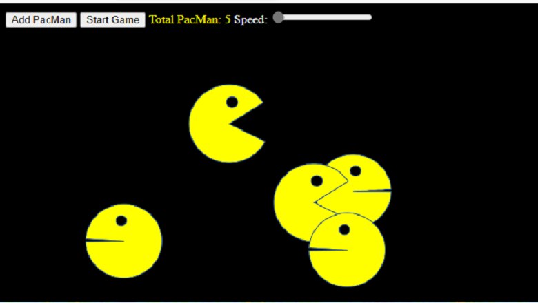

# centuriontech.github.io

## Int3lltec Group WEB Dev Portfolio

### Title of the project: PacMen
Description of the project: Create and move pacman figures across the screen  
How to Run: Select the link in Int3lltec Group WEB Dev Portfolio  
Roadmap of future improvements:  

## PacMen Repository
<a href="https://github.com/CenturionTech/pacmen">PacMen Exercise </a>

### Title of the project: Eyes
Description of the project: Move Eyes on th screen following the mouse  
How to Run: Select the link in Int3lltec Group WEB Dev Portfolio  
Roadmap of future improvements:  

## Eyes Repository
<a href="https://github.com/CenturionTech/eyes">Eyes Exercise </a>

### Title of the project: MBTA Real Time Bus Tracker
Description of the project: Show the Buses Locations in Route#1 of MBTA in real time  
How to Run: Select the link in Int3lltec Group WEB Dev Portfolio ,click on the button "Show MBTA Route# 1 Bus Locations in real time"  
Roadmap of future improvements: Show a table of current buses in Route#

## MBTA Real Time Bus Tracker Repository
<a href="https://github.com/CenturionTech/mbta">MBTA Route#1 Tracking </a>

## License information: 

### MIT License

Copyright (c) 2022 CenturionTech

Permission is hereby granted, free of charge, to any person obtaining a copy
of this software and associated documentation files (the "Software"), to deal
in the Software without restriction, including without limitation the rights
to use, copy, modify, merge, publish, distribute, sublicense, and/or sell
copies of the Software, and to permit persons to whom the Software is
furnished to do so, subject to the following conditions:

The above copyright notice and this permission notice shall be included in all
copies or substantial portions of the Software.

THE SOFTWARE IS PROVIDED "AS IS", WITHOUT WARRANTY OF ANY KIND, EXPRESS OR
IMPLIED, INCLUDING BUT NOT LIMITED TO THE WARRANTIES OF MERCHANTABILITY,
FITNESS FOR A PARTICULAR PURPOSE AND NONINFRINGEMENT. IN NO EVENT SHALL THE
AUTHORS OR COPYRIGHT HOLDERS BE LIABLE FOR ANY CLAIM, DAMAGES OR OTHER
LIABILITY, WHETHER IN AN ACTION OF CONTRACT, TORT OR OTHERWISE, ARISING FROM,
OUT OF OR IN CONNECTION WITH THE SOFTWARE OR THE USE OR OTHER DEALINGS IN THE
SOFTWARE.
