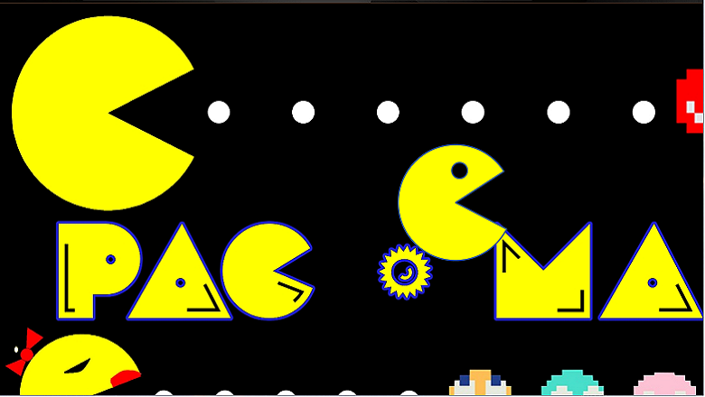

# centuriontech.github.io

## Int3lltec Group WEB Dev Portfolio

### Title of the project: PacMan
Description of the project: Move pacman across the screen  
How to Run: Select the link in Centurion Tech's Portfolio > Projects  
Roadmap of future improvements:  

## PacMan Repository
<a href="https://github.com/CenturionTech/pacman">PacMan Exercise </a>

### Title of the project: PacMen
Description of the project: Create and move pacman figures across the screen  
How to Run: Select the link in Centurion Tech's Portfolio > Projects  
Roadmap of future improvements:  

## PacMen Repository
<a href="https://github.com/CenturionTech/pacmen">PacMen Exercise </a>

### Title of the project: Balls Bouncing
Description of the project: Balls bouncing across the screen  
How to Run: Select the link in Centurion Tech's Portfolio > Projects  
Roadmap of future improvements:  

## Balls Bouncing Repository
<a href="https://github.com/CenturionTech/balls">Balls Bouncing Exercise </a>

### Title of the project: Eyes
Description of the project: Move Eyes on th screen following the mouse  
How to Run: Select the link in Centurion Tech's Portfolio > Projects  
Roadmap of future improvements:  

## Eyes Repository
<a href="https://github.com/CenturionTech/eyes">Eyes Exercise </a>

### Title of the project: MBTA Real Time Bus Tracker
Description of the project: Show the Buses Locations in Route#1 of MBTA in real time  
How to Run: Select the link in Centurion Tech's Portfolio > Projects ,click on the button "Show MBTA Route# 1 Bus Locations in real time"  
Roadmap of future improvements: Show a table of current buses in Route#

## MBTA Real Time Bus Tracker Repository
<a href="https://github.com/CenturionTech/mbta">MBTA Route#1 Tracking </a>

### Title of the project: Hanoi's Towers
Description of the project: Resolve the Hanoi's Towers  
How to Run: Select the link in Centurion Tech's Portfolio > Projects  
Roadmap of future improvements: 

## Hanoi's Towers Repository
<a href="https://github.com/CenturionTech/hanoi">Hanoi's Towers </a>

